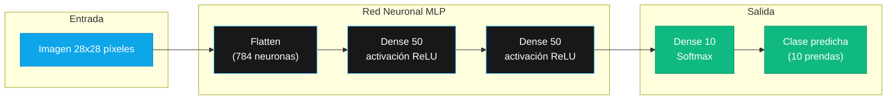
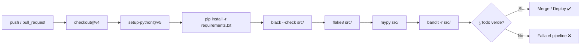

<div align="center">

# 🧠 Clasificador Fashion MNIST — Deep Learning

### Red Neuronal de Perceptrones Multicapa (MLP) para clasificación de prendas de vestir con TensorFlow & Keras, blindada con estándares DevSecOps.


[](https://www.tensorflow.org/)
[](https://www.python.org/)
[](https://github.com/esmoliname/clasificador-fashion-mnist/actions)
[](https://github.com/psf/black)
[](https://bandit.readthedocs.io/)
[](https://github.com/pre-commit/pre-commit)

</div>

---

## 📑 Índice

1. [Descripción](#-descripción)
2. [Demo / Resultados](#-demo--resultados)
3. [Arquitectura de la Red Neuronal](#-arquitectura-de-la-red-neuronal)
4. [Características Técnicas](#-características-técnicas)
5. [DevSecOps & OWASP](#-devsecops--owasp)
6. [Estructura del Proyecto](#-estructura-del-proyecto)
7. [Ejecución Local](#-ejecución-local)
8. [Calidad y Seguridad](#-calidad-y-seguridad)

---

## 🚀 Descripción

Clasificador de imágenes de prendas de vestir (**Fashion MNIST**, 10 clases) construido con
**TensorFlow 2 / Keras 3**, que aplica estándares profesionales de **Clean Code**, análisis
estático y **auditoría de seguridad continua** (pre-commit + GitHub Actions).

El modelo es una red **MLP (Multi-Layer Perceptron)** que logra una exactitud superior al
**88 %** sobre el conjunto de prueba de 10 000 imágenes, con un pipeline reproducible,
versionado y auditado de extremo a extremo.

---

## 🎬 Demo / Resultados

> *Espacio reservado para la animación del entrenamiento o predicciones en tiempo real.*


Durante el entrenamiento se registra la evolución de pérdida y exactitud (train/validation)
en cada época, lo que permite auditar el rendimiento del modelo (OWASP ML A09).

---

## 🏗️ Arquitectura de la Red Neuronal

El flujo del tensor desde el píxel hasta la clase predicha:



**Clases clasificadas:** Camiseta/top, Pantalón, Suéter, Vestido, Abrigo, Sandalia, Camisa, Zapatilla, Bolso, Botín.

---

## ⚙️ Características Técnicas

| Aspecto | Detalle |
|---------|---------|
| **Framework** | TensorFlow 2.21.0 + Keras 3 |
| **Arquitectura** | MLP: `Flatten` → `Dense` → `Dense` → `Softmax` |
| **Optimizador** | Adam |
| **Pérdida** | `sparse_categorical_crossentropy` |
| **Métrica** | Exactitud (`accuracy`) |
| **Épocas / Batch** | 10 / 32 |
| **Validación** | `validation_split` del 20 % |
| **Preprocesado** | Normalización de píxeles a [0, 1] (validación de entrada — OWASP A01) |
| **Tipado** | `TypeAlias` + anotaciones de tipos (`mypy --strict`) |

---

## 🛡️ DevSecOps & OWASP

### Integración de pre-commit

Cada `commit` dispara automáticamente los **hooks de seguridad y calidad** definidos en
`.pre-commit-config.yaml`, actuando como *pipeline de revisión local* antes de que el
código toque el remoto:

| Hook | Rol |
|------|-----|
| **Bandit** (`-ll -ii`) | Auditoría de seguridad estática sobre el código Python, enfocada a vulnerabilidades tipo OWASP. |
| **Black** | Formateo automático del código (estilo PEP 8). |
| **Flake8** (`--max-line-length=88`) | Linting de estilo alineado con el límite de Black. |
| **trailing-whitespace** | Elimina espacios en blanco residuales. |
| **check-yaml** | Valida la sintaxis de archivos YAML (workflows, config). |
| **check-added-large-files** | Bloquea artefactos pesados (`--maxkb=50000`) como pesos de modelo. |

### Análisis estático con Bandit para ML

En Machine Learning, Bandit identifica riesgos de seguridad específicos del ciclo de vida
del modelo:

- **Inyección de código en artefactos**: detección de ejecución de código generado
  (`eval`, `exec`, `pickle`) en pipelines de datos o carga de modelos.
- **Entradas no confiables**: uso de datos no saneados en operaciones sensibles.
- **Exposición de secretos**: credenciales o claves hardcodeadas en scripts de entrenamiento.
- **Dependencias peligrosas**: llamadas a subprocesos o funciones inseguras.

La auditoría corre en **dos niveles**: local (pre-commit) y remoto (GitHub Actions),
garantizando que ningún código vulnerable llegue a `main`.

### Flujo CI/CD automatizado (GitHub Actions)



Además, **Dependabot** monitoriza dependencias vulnerables/obsoletas
(OWASP ML A06 — Componentes Vulnerables) y genera PRs de actualización automática.

---

## 📁 Estructura del Proyecto

```
clasificador-fashion-mnist/
├── .github/
│   └── workflows/
│       └── ci.yml                  # Pipeline CI + auditoría de seguridad
├── frontend/
│   └── index.html                  # SPA Vue 3 + Tailwind + Axios (CDN, autocontenida)
├── src/
│   ├── app.py                      # API REST FastAPI (inferencia del modelo)
│   └── main.py                     # Clasificador Fashion MNIST (MLP)
├── Dockerfile                      # Contenedor Docker opcional del backend
├── .gitignore                      # Excluye venv, datos y artefactos de entrenamiento
├── .pre-commit-config.yaml         # Hooks DevSecOps (Bandit, Black, Flake8...)
├── README.md                       # Documentación del proyecto
└── requirements.txt                # Dependencias fijadas exactamente (reproducibilidad)
```

---

## 💻 Ejecución Local

### 1. Clonar el repositorio

```bash
git clone https://github.com/esmoliname/clasificador-fashion-mnist.git
cd clasificador-fashion-mnist
```

### 2. Crear y activar el entorno virtual

```bash
python -m venv venv
venv\Scripts\activate          # Windows (PowerShell)
# source venv/bin/activate     # Linux / macOS
```

### 3. Actualizar pip e instalar dependencias

```bash
python -m pip install --upgrade pip
pip install -r requirements.txt
```

### 4. Instalar los hooks de seguridad

```bash
pre-commit install
```

### 5. Entrenar y evaluar el clasificador

```bash
python src/main.py
```

El script descarga el dataset oficial, normaliza los datos, entrena la MLP durante
10 épocas y reporta pérdida y exactitud sobre el conjunto de prueba.

### 6. Probar la aplicación localmente

La aplicación se ejecuta en dos piezas: la API FastAPI (`src/app.py`, que expone
`POST /predict`) y el cliente SPA Vue 3 (`frontend/index.html`).

#### Levantar el backend

En una terminal, dentro de la carpeta del proyecto, ejecuta:

```bash
uvicorn src.app:app --host 0.0.0.0 --port 10000
```

La API quedará escuchando en `http://localhost:10000` y aceptará imágenes vía
`multipart/form-data` en `POST /predict`.

#### Usar la interfaz

Haz **doble clic** en el archivo `frontend/index.html` para abrirlo en el navegador.
El cliente ya está configurado para apuntar a `http://localhost:10000/predict`.

Sube una foto de una prenda, presiona **🧠 Predecir prenda** y verás el Top 3 de
clases con su probabilidad.

---

## ✅ Calidad y Seguridad

Verificación completa de calidad y seguridad (mismas reglas que el CI):

```bash
black src/                        # Formateo automático
flake8 src/                       # Estilo (PEP 8, máx. 88 columnas)
mypy src/                         # Tipos estáticos
pylint src/main.py                # Análisis estático
bandit -r src/                    # Auditoría de seguridad (OWASP)
pre-commit run --all-files        # Todos los hooks DevSecOps
```

---

<div align="center">

**Construido con** [TensorFlow](https://www.tensorflow.org/) · [Keras](https://keras.io/) ·
[pre-commit](https://pre-commit.com/) · [Bandit](https://bandit.readthedocs.io/) ·
[GitHub Actions](https://github.com/features/actions)

</div>